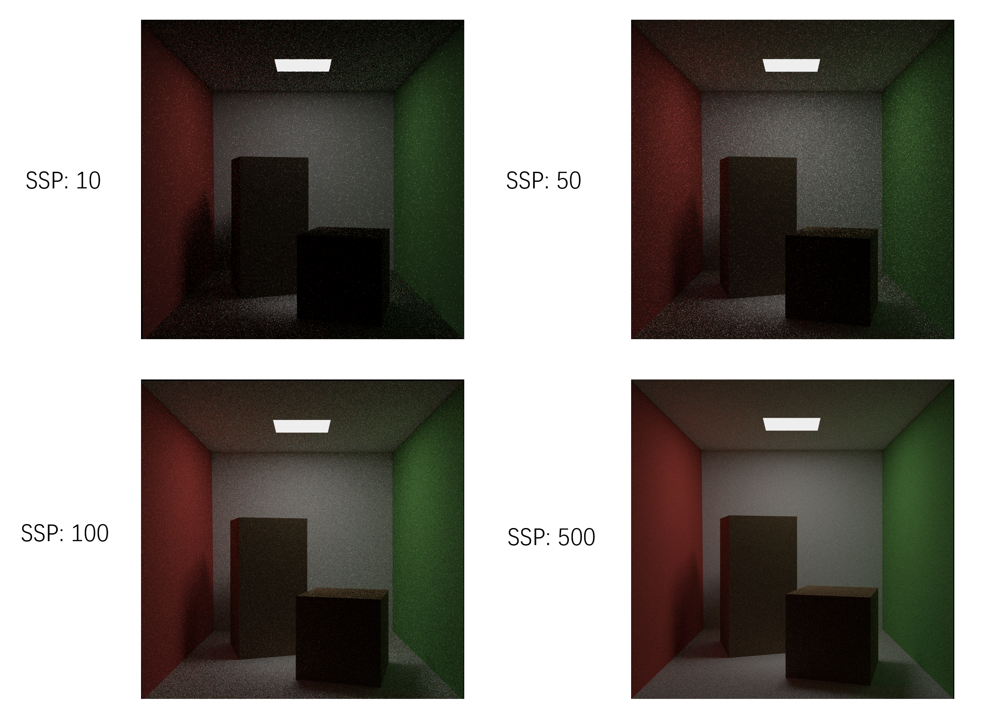

# Easy Ray Tracing

使用 **openGL** 实现简单光线追踪渲染 **CornellBox.**

项目中所有知识来源于 **《GAMES101-现代计算机图形学入门》- 闫令琪**。

国内公认最好的计算机图形学入门。

项目中的代码都由自己实现，写的不好的地方就见笑啦，主要代码都标有注释，有光线追踪基础的话很容易看懂。

开源供所有入门光线追踪的大家一起学习~

## Development Environment

> macOS, Linux 可以基于 openGL 的跨平台的特性适当修改运行环境。

* Windows 11

* C++ 14

* Visual Studio 2022

* openGL 4.2

* GPU RTX 3080Ti

## Contains knowledge points

* 路径追踪
* 全局光照
* BRDF
* 对光源采样
* 渲染方程
* 蒙特卡罗积分
* BVH加速
* 俄罗斯轮盘赌
* ...

## Comparison of different pixel sampling rates

屏幕像素采样率越高，效果越好。当然，效果越好的代价就是渲染速度变慢。

SPP大小的设置以及光线最大弹射次数，根据GPU性能进行选择~

## Contributing
- yuzhm
