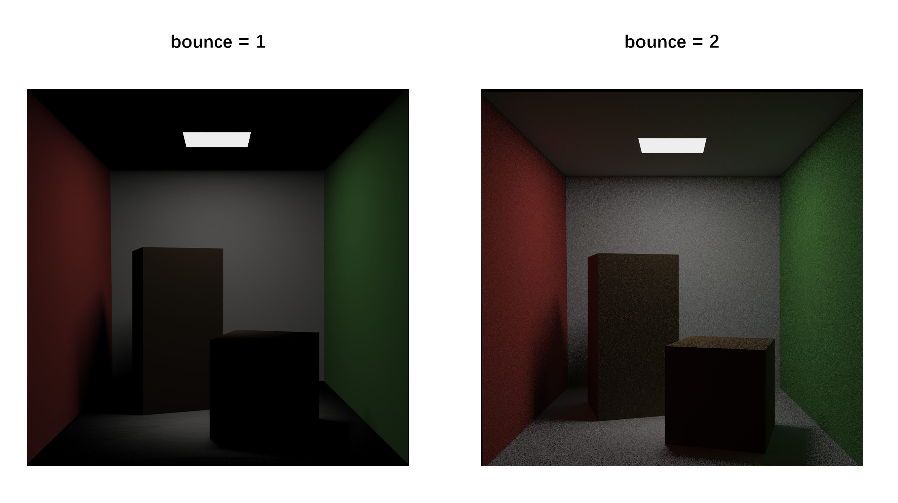

# Easy Ray Tracing

使用 **openGL** 实现简单光线追踪渲染 **CornellBox.**

项目中所有知识来源于 **《GAMES101-现代计算机图形学入门》- 闫令琪**。

公认最好的计算机图形学入门课。

项目中的代码都由自己实现，写的不好的地方就见笑啦，主要代码都标有注释，有光线追踪基础的话很容易看懂。

开源供所有入门光线追踪的大家一起学习~

## Development Environment

> macOS, Linux 可以基于 openGL 的跨平台的特性适当修改运行环境。

* Windows 11

* C++ 14

* Visual Studio 2022

* openGL 4.2

* GPU RTX 3080Ti

## Contains knowledge points

* 路径追踪
* 全局光照
* BRDF
* 对光源采样
* 渲染方程
* 蒙特卡罗积分
* BVH加速
* 俄罗斯轮盘赌
* ...

## Comparison

**光线弹射的次数影响全局光照。**

当 bounce = 1 只弹射一次时，只有直接光照，阴影里照不到光照。

当 bounce > 1 时，阴影收到全局光照叠加的影响。

**屏幕像素采样率(ssp)越高，效果越好。当然，效果越好的代价就是渲染速度变慢。**

SSP, bounce设置的大小，根据GPU性能自行测试~

如下：bounce = 8, 不同 ssp 的结果。

## Contributing
- yuzhm
